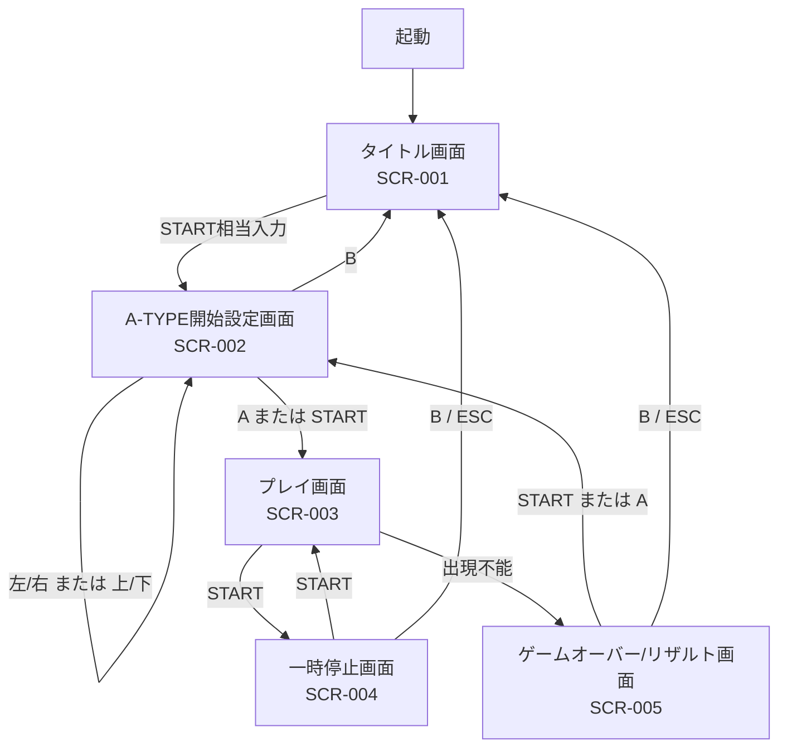
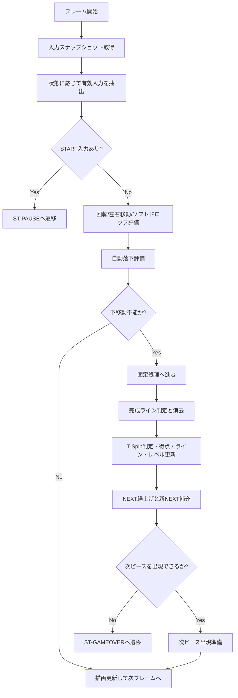

# ランタイムフローチャート図（Mermaid） / Runtime Flowchart Diagram (Mermaid)

- 文書ID: DOC-SPC-027
- 最終更新日: 2026-03-23
- 目的: 画面遷移とプレイフレーム内の判断順序を Mermaid フローチャートで可視化し、外部仕様レビューを補助する
- 関連文書:
  - `docs/02_external_spec/21_ui_screen_spec.md`
  - `docs/02_external_spec/25_pause_gameover_resume_spec.md`
  - `docs/03_internal_design/32_state_machine_design.md`

---

## 1. 本書の位置付け

本書は外部仕様補助文書であり、画面要件の正本は `21_ui_screen_spec.md`、一時停止・ゲームオーバー仕様の正本は `25_pause_gameover_resume_spec.md`、内部責務の正本は `32_state_machine_design.md` が保持する。
本書は、これらの文書を横断して主要フローを Mermaid で視覚化した補助資料である。

---

## 2. 画面遷移フローチャート

---

## 3. プレイフレーム処理フローチャート

---

## 4. レビュー時の確認観点

1. 画面フローが `21_ui_screen_spec.md` の画面遷移表と一致していること
2. 一時停止中に通常プレイ入力へ戻らないことが図から読めること
3. プレイフレーム内で START による一時停止判定が優先されていること
4. 出現不能時にゲームオーバーへ遷移することが明示されていること
