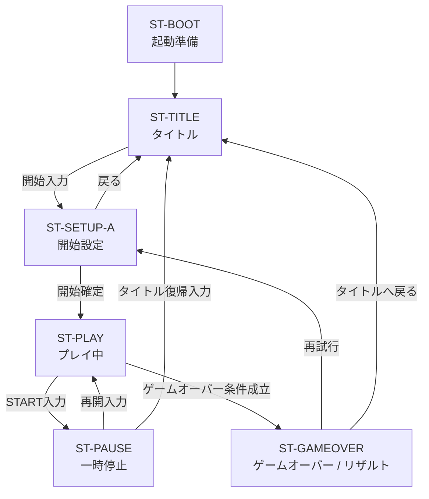
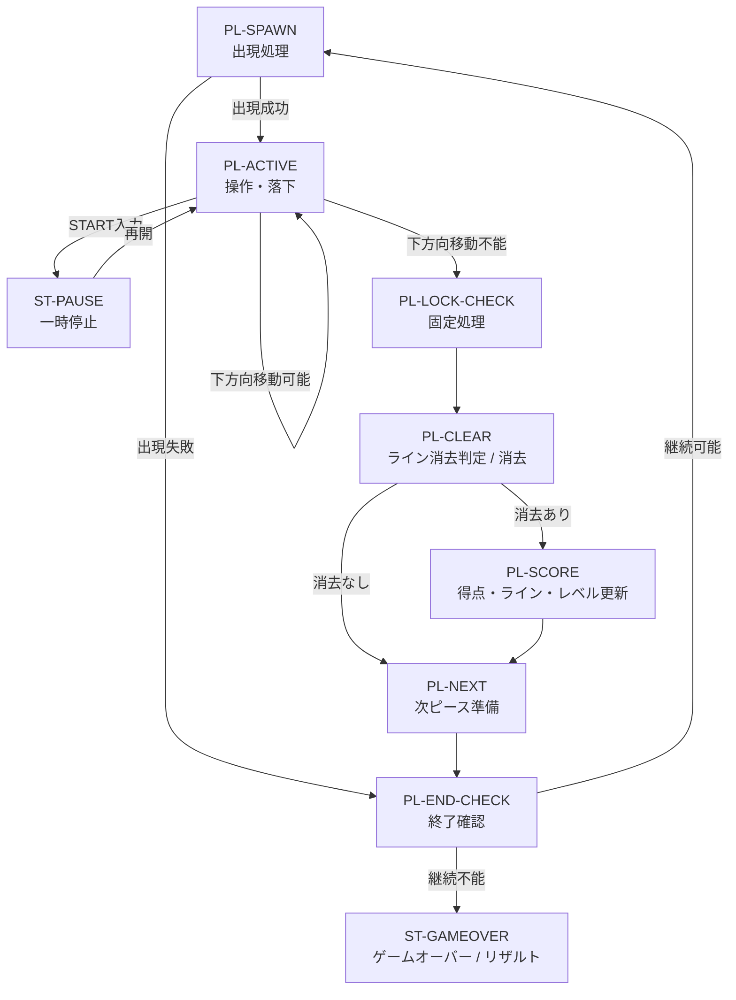

# ランタイム処理フロー図 / Runtime Flowchart (Mermaid)

- 文書ID: DOC-DSN-027
- 文書名: ランタイム処理フロー図 / Runtime Flowchart (Mermaid)
- 最終更新日: 2026-03-24
- 対象プロジェクト: 仮称 `block-puzzle-docdd`
- 目的: 本プロジェクトにおけるランタイム処理の全体フローを Mermaid 図で可視化し、上位状態・プレイ中サブ状態・主要分岐の関係を一目で確認できるようにする
- 関連文書:
  - `docs/00_overview/00_document_map.md`
  - `docs/02_external_spec/20_game_rules_spec.md`
  - `docs/02_external_spec/21_ui_screen_spec.md`
  - `docs/02_external_spec/24_piece_rotation_collision_spec.md`
  - `docs/03_internal_design/32_state_machine_design.md`
  - `docs/03_internal_design/34_module_design.md`
  - `docs/03_internal_design/38_runtime_state_transition_mermaid.md`
  - `docs/04_quality_assurance/40_test_strategy.md`

---

## 1. 本書の目的

本書は、本プロジェクトにおける**ランタイム処理の全体像**を Mermaid 図で示すための文書である。

`32_state_machine_design.md` が状態と遷移条件を文章中心で定義する文書であるのに対し、本書は以下を**処理の流れ**として把握しやすくすることを目的とする。

- 起動からタイトル、設定、プレイ、ポーズ、ゲームオーバーまでの上位フロー
- ST-PLAY 内でのサブ状態処理順
- 一時停止やゲームオーバーへの分岐
- 1プレイサイクルの繰り返し構造
- 関連文書との責務分担

本書は、**状態遷移図そのものの代替**ではなく、状態遷移図を補完する**処理フロー図**として位置付ける。

---

## 2. 本書の位置付け

本書は、以下の関係で読むことを想定する。

- `20_game_rules_spec.md`  
  外部から見たルールの定義
- `24_piece_rotation_collision_spec.md`  
  回転・移動・衝突判定の成立条件
- `32_state_machine_design.md`  
  上位状態およびサブ状態の定義
- `34_module_design.md`  
  モジュール責務の整理
- `38_runtime_state_transition_mermaid.md`  
  状態遷移の図示

本書は、そのうち特に**ランタイム中に何がどの順で処理されるか**を可視化する。

---

## 3. 図の読み方

### 3.1 上位状態
図の前半では、以下の上位状態を扱う。

- ST-BOOT
- ST-TITLE
- ST-SETUP-A
- ST-PLAY
- ST-PAUSE
- ST-GAMEOVER

### 3.2 プレイ中サブ状態
ST-PLAY 内では、`32_state_machine_design.md` と用語を一致させるため、以下のサブ状態を扱う。

- PL-SPAWN
- PL-ACTIVE
- PL-LOCK-CHECK
- PL-CLEAR
- PL-SCORE
- PL-NEXT
- PL-END-CHECK

### 3.3 分岐の見方
分岐は、主に以下を示す。

- 開始入力
- 再開入力
- タイトル復帰入力
- 出現成功 / 失敗
- 下方向移動可能 / 不可能
- ライン消去あり / なし
- 継続可能 / 継続不能

---

## 4. ランタイム全体フロー

### 補足
- この図は、上位状態の大きな流れを示す
- ST-PLAY 内部で何が起きるかは次節で詳細化する
- B-TYPE 系状態は初期フェーズの対象外であるため、本図には含めない

---

## 5. ST-PLAY 内サブ状態フロー

### 補足
- `PL-ACTIVE` は、通常プレイ入力と自動落下を受け付ける唯一のサブ状態である
- `PL-LOCK-CHECK` 以降は、通常プレイ入力を受け付けない
- `PL-END-CHECK` は、継続可否を集約して判断する終端確認ポイントである

---

## 6. 1プレイサイクルの基本処理順

本プロジェクトにおける 1 プレイサイクルの基本処理順は、以下の通りとする。

1. `PL-SPAWN`
   - 次ピースを現在ピースとして出現させる
   - 出現可否を確認する

2. `PL-ACTIVE`
   - 左右移動、回転、ソフトドロップを受け付ける
   - 自動落下を進める
   - 下方向移動不能を検出する

3. `PL-LOCK-CHECK`
   - 現在ピースを固定済みブロックへ変換する

4. `PL-CLEAR`
   - 完成ラインを検出する
   - 必要に応じて消去する
   - 上部ブロックを詰める

5. `PL-SCORE`
   - 得点を加算する
   - ライン数を更新する
   - レベルを更新する
   - 落下速度を反映する

6. `PL-NEXT`
   - NEXT を繰り上げる
   - 次の出現候補を補充する

7. `PL-END-CHECK`
   - ゲーム継続可否を確認する
   - 継続可能なら次の `PL-SPAWN` へ進む
   - 継続不能なら `ST-GAMEOVER` へ進む

---

## 7. 一時停止分岐の扱い

### 7.1 一時停止受付位置
一時停止は、原則として `PL-ACTIVE` 中にのみ受け付ける。

### 7.2 一時停止中に止まるもの
`ST-PAUSE` では、少なくとも以下を停止する。

- 自動落下
- 下方向移動判定
- 固定処理
- ライン消去処理
- 得点 / ライン / レベル更新
- 通常プレイ入力処理

### 7.3 再開先
再開時は、原則として一時停止直前のプレイ文脈へ戻る。  
初期方針としては、`PL-ACTIVE` へ戻す構成を基本とする。

---

## 8. ゲームオーバー分岐の扱い

### 8.1 ゲームオーバー発火点
ゲームオーバーは、少なくとも以下を契機として `ST-GAMEOVER` へ遷移する。

- 新規ピースが出現不能
- 継続不能条件成立

### 8.2 集約ポイント
ゲームオーバー分岐は、可能な限り `PL-END-CHECK` を終端判断点として集約する。

### 8.3 設計意図
終了条件を複数箇所へ散らさず、**終了確認の責務を集約する**ことで、設計・レビュー・試験の追跡性を高める。

---

## 9. `32_state_machine_design.md` との対応

本書と `32_state_machine_design.md` の関係を以下に示す。

| 本書の対象 | `32_state_machine_design.md` での対応 |
|---|---|
| ST-BOOT | 3章 上位状態 |
| ST-TITLE | 5.1 |
| ST-SETUP-A | 5.2 |
| ST-PLAY | 5.3 |
| ST-PAUSE | 5.4 |
| ST-GAMEOVER | 5.5 |
| PL-SPAWN | 6章 / 7章 |
| PL-ACTIVE | 6章 / 7章 / 8章 |
| PL-LOCK-CHECK | 6章 / 7章 |
| PL-CLEAR | 6章 / 7章 |
| PL-SCORE | 6章 / 7章 / 10章 |
| PL-NEXT | 6章 / 7章 |
| PL-END-CHECK | 6章 / 7章 / 12章 |

### 補足
- `32_state_machine_design.md` は、状態定義・責務・入力・遷移条件を文章で定義する
- 本書は、それらを処理順として図示する補助文書である

---

## 10. `34_module_design.md` との対応

本書のフローは、概念上、以下のモジュール責務と接続する。

| 処理段階 | 主に関係する責務 |
|---|---|
| 起動準備 | application bootstrap / config loading |
| タイトル / 設定 | UI controller / menu handling |
| 出現処理 | `spawn_service`, `game_session` |
| 操作・落下 | `input_mapper`, `state_controller`, `active_piece_service`, `board_rules` |
| 固定処理 | `lock_resolver`, `board_rules` |
| ライン消去 | `board_rules`, `lock_resolver` |
| 得点・更新 | `tspin_detector`, `scoring_service`, `level_progression_service` |
| 次ピース準備 | `spawn_service`, `game_session` |
| 終了確認 | `state_controller`, `game_session` |
| 一時停止 | `state_controller`, `renderer` |
| ゲームオーバー | `renderer`, `game_session` |

### 補足
- 具体モジュール名は `34_module_design.md` 側で確定した名称に合わせている
- 本書では、責務の流れをランタイム順へ対応づける

---

## 11. テスト観点との接続

本書は、少なくとも以下の試験観点に接続する。

### 11.1 `40_test_strategy.md`
- 状態遷移試験
- ルール単位試験
- 境界条件試験

### 11.2 想定される代表試験
- spawn 成功時に `PL-ACTIVE` へ進む
- spawn 失敗時にゲームオーバーへ進む
- 下方向移動不能時に `PL-LOCK-CHECK` へ進む
- ライン消去あり時に `PL-SCORE` を経由する
- 一時停止中に通常プレイ処理が進まない
- 継続不能時に `ST-GAMEOVER` へ遷移する

### 11.3 補助文書との接続
`46_test_fixtures_catalog.md` および `41_test_cases_game_rules.md`〜`43_test_cases_edge_conditions.md` から、本図の処理順を参照できる状態が望ましい。

---

## 12. 本書で意図的に扱わないもの

本書では、以下は詳細定義しない。

- ピースごとの回転座標表
- 盤面セル座標の厳密データ構造
- フレーム単位の内部時間計算式
- 描画更新の低レベル実装順
- キーリピートや入力バッファの内部実装詳細

これらは、以下へ委譲する。

- `24_piece_rotation_collision_spec.md`
- `33_data_model.md`
- `34_module_design.md`
- `36_input_timing_design.md`

---

## 13. 受入観点（本書レベル）

本書に基づく受入観点は、少なくとも以下とする。

1. 起動からタイトル、設定、プレイ、一時停止、ゲームオーバーまでの上位フローが図示されていること
2. ST-PLAY 内のサブ状態処理順が図示されていること
3. 一時停止およびゲームオーバー分岐が明示されていること
4. `32_state_machine_design.md` と対応づけられていること
5. `34_module_design.md` および `40_test_strategy.md` と接続可能であること
6. 処理フロー図と状態遷移図の役割分担が明確であること

---

## 14. 結論

本書は、本プロジェクトのランタイム処理を**処理順の観点から可視化する補助文書**である。

特に重要なのは、以下を図として確認できる点である。

- 上位状態の全体フロー
- ST-PLAY 内の 1 サイクル処理順
- 一時停止分岐
- ゲームオーバー分岐
- 状態設計、モジュール設計、試験方針との接続点

この図を基準にすることで、文章だけでは掴みにくい処理構造を、設計レビューや将来の実装検討時に共有しやすくする。

---

## 15. 変更履歴

- 2026-03-24: 初版作成
