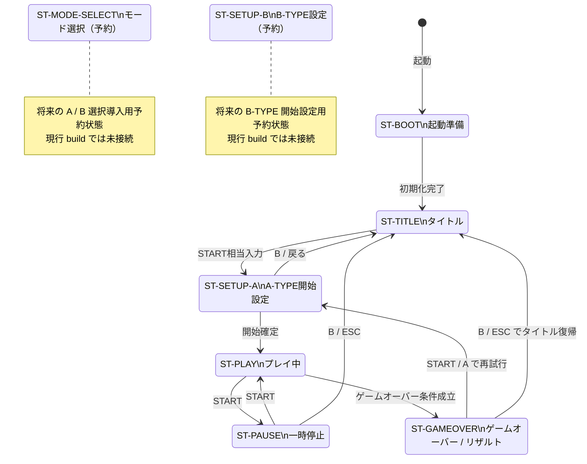
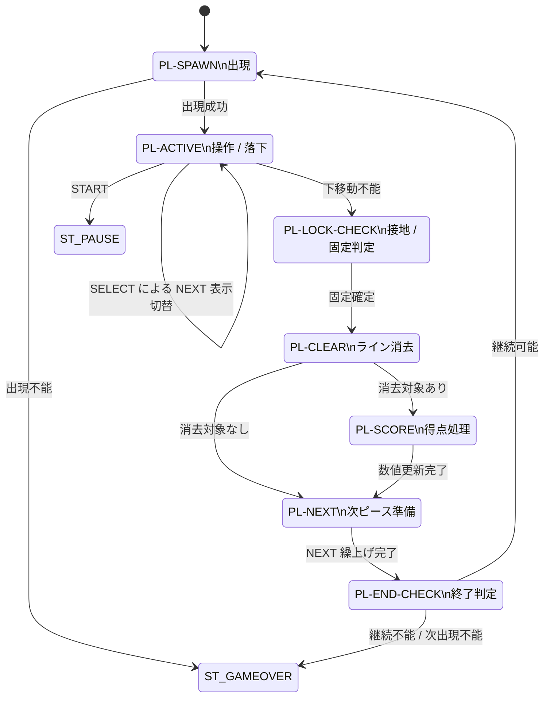

# ランタイム状態遷移図（Mermaid） / Runtime State Transition Diagram (Mermaid)

- 文書ID: DOC-DSN-038
- 文書名: ランタイム状態遷移図（Mermaid） / Runtime State Transition Diagram (Mermaid)
- 最終更新日: 2026-03-24
- 対象プロジェクト: 仮称 `block-puzzle-docdd`
- 目的: `32_state_machine_design.md` で定義した上位状態および `ST-PLAY` サブ状態を Mermaid 図で可視化し、レビュー時に状態遷移そのものを追いやすくする
- 関連文書:
  - `docs/03_internal_design/27_runtime_flowchart_mermaid.md`
  - `docs/03_internal_design/32_state_machine_design.md`
  - `docs/03_internal_design/34_module_design.md`
  - `docs/02_external_spec/21_ui_screen_spec.md`
  - `docs/02_external_spec/25_pause_gameover_resume_spec.md`
  - `docs/04_quality_assurance/40_test_strategy.md`

---

## 1. 本書の位置付け

本書は内部設計補助文書であり、**状態定義・責務・受入観点の正本は `32_state_machine_design.md`** が保持する。  
本書は、その設計内容を **Mermaid による状態遷移図** として確認できるようにした派生文書である。

### 1.1 `27_runtime_flowchart_mermaid.md` との役割分担
- `27_runtime_flowchart_mermaid.md`  
  **処理順** を示す補助図  
  例: spawn → active → lock → clear → score → next → end-check

- `38_runtime_state_transition_mermaid.md`  
  **状態と遷移条件** を示す補助図  
  例: どの入力・条件で、どの状態へ移るか

本書では、処理の実行順や内部処理列の詳細説明には立ち入らず、**状態遷移の構造そのもの**に集中する。

---

## 2. 図の読み方

### 2.1 上位状態図
上位状態図では、プレイヤーから見て認識しやすい大きな状態を扱う。

- ST-BOOT
- ST-TITLE
- ST-SETUP-A
- ST-PLAY
- ST-PAUSE
- ST-GAMEOVER
- ST-MODE-SELECT（予約）
- ST-SETUP-B（予約）

### 2.2 サブ状態図
サブ状態図では、`ST-PLAY` 内部で用いるランタイム処理状態を扱う。

- PL-SPAWN
- PL-ACTIVE
- PL-LOCK-CHECK
- PL-CLEAR
- PL-SCORE
- PL-NEXT
- PL-END-CHECK

### 2.3 注意
- 本図の遷移条件は、`32_state_machine_design.md` の本文定義を図として確認するためのものとする
- `SELECT` による NEXT 表示切替は **ST-PLAY / PL-ACTIVE に留まる UI 状態更新** として扱う
- 処理順の解説は `27_runtime_flowchart_mermaid.md` を参照すること

---

## 3. 上位状態遷移図

### 補足
- 現行フローでは、A-TYPE 主軸のため `ST-MODE-SELECT` および `ST-SETUP-B` は予約状態に留める
- `ST-PLAY` の内部詳細は次節のサブ状態図で扱う

---

## 4. ST-PLAY サブ状態遷移図

### 補足
- `PL-ACTIVE` は通常プレイ入力を受け付ける唯一のサブ状態である
- `PL-LOCK-CHECK` 以降では、通常プレイ入力を処理してはならない
- `PL-CLEAR -> PL-NEXT` の直行遷移を設けることで、**ライン消去なし**のケースを図で明示する
- T-Spin 判定は `PL-SCORE` に含まれる得点処理責務として扱う

---

## 5. 図から読み取るべき設計要点

### 5.1 START 優先
`32_state_machine_design.md` の方針どおり、`START` はプレイ中において一時停止遷移を発火させる優先入力である。

### 5.2 SELECT は進行系遷移を発火しない
`SELECT` は NEXT 表示切替用であり、`PL-ACTIVE` 内の UI 状態更新に留まる。  
状態そのものを別状態へ進める入力ではない。

### 5.3 ゲームオーバー判定の入口
ゲームオーバーは少なくとも以下から到達する。

- `PL_SPAWN` 時の出現不能
- `PL_END_CHECK` 時の継続不能

### 5.4 予約状態の扱い
B-TYPE 関連状態は予約として図示するが、現行 build の遷移本線には接続しない。

---

## 6. `32_state_machine_design.md` との対応

| 本書の対象 | `32_state_machine_design.md` での対応 |
|---|---|
| 上位状態 | 3章〜5章 |
| PL-SPAWN | 6章 / 7章 |
| PL-ACTIVE | 6章 / 7章 / 8章 |
| PL-LOCK-CHECK | 6章 / 7章 |
| PL-CLEAR | 6章 / 7章 |
| PL-SCORE | 6章 / 7章 / 10章 |
| PL-NEXT | 6章 / 7章 |
| PL-END-CHECK | 6章 / 7章 / 12章 |

### 補足
- 状態定義、entry / exit、副作用、入力優先順の正本は `32_state_machine_design.md` とする
- 本書は、その内容をレビューしやすいよう図示した派生文書である

---

## 7. `27_runtime_flowchart_mermaid.md` との対応

本書と `27_runtime_flowchart_mermaid.md` の違いを以下に示す。

| 文書 | 主眼 | 例 |
|---|---|---|
| `27_runtime_flowchart_mermaid.md` | 処理順 | 固定後にライン消去判定し、その後得点更新する |
| `38_runtime_state_transition_mermaid.md` | 状態遷移 | `PL-ACTIVE` で下移動不能になったら `PL-LOCK-CHECK` へ移る |

### 補足
- 状態は同じでも、読む観点が異なる
- レビュー時は 27 と 38 を対で確認すること

---

## 8. Diagram-Driven レビュー時の確認観点

1. 上位状態と画面遷移が `21_ui_screen_spec.md` と矛盾していないこと
2. 一時停止・ゲームオーバー遷移が `25_pause_gameover_resume_spec.md` と一致していること
3. `SELECT` が UI 状態更新として扱われ、進行系遷移を発火しないこと
4. `PL-CLEAR -> PL-NEXT` の直行遷移により、ライン消去なしケースが図で読めること
5. T-Spin 判定責務が `PL-SCORE` に置かれていること
6. 予約状態が現行フローへ未接続であることが読み取れること
7. サブ状態図が `27_runtime_flowchart_mermaid.md` の処理順説明と矛盾しないこと

---

## 9. 結論

本書は、`32_state_machine_design.md` の状態定義を、**状態遷移の観点だけに絞って可視化した補助図**である。

本書で特に確認したいのは、以下である。

- 上位状態の接続関係
- `ST-PLAY` 内サブ状態の遷移関係
- 一時停止とゲームオーバーの入口
- `SELECT` の位置付け
- 予約状態の未接続性

処理順の理解は `27_runtime_flowchart_mermaid.md`、状態定義の正本は `32_state_machine_design.md` を参照し、本書はその中間でレビュー負荷を下げる図面として扱う。

---

## 10. 変更履歴

- 2026-03-24: 修正版初版作成
