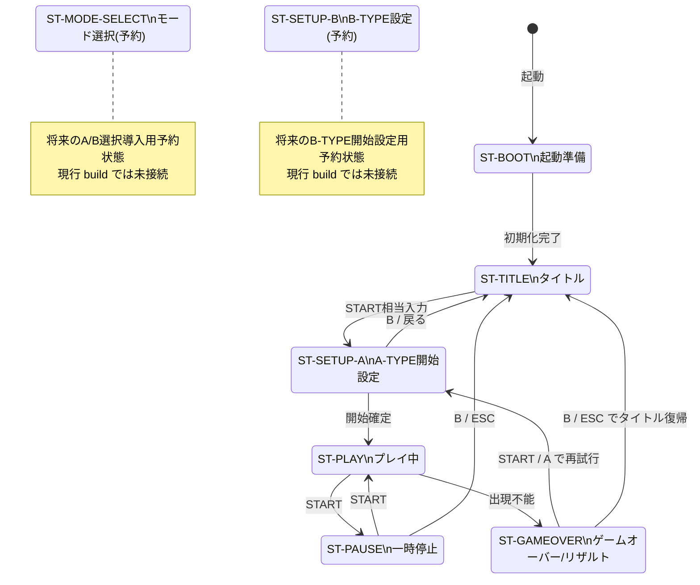
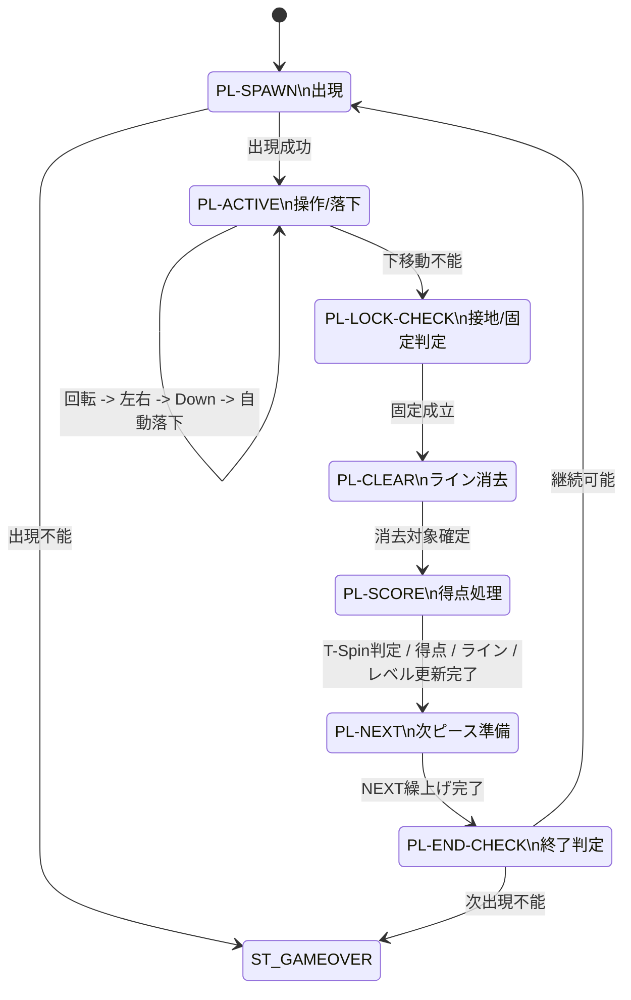

# ランタイム状態遷移図（Mermaid） / Runtime State Transition Diagram (Mermaid)

- 文書ID: DOC-DSN-038
- 最終更新日: 2026-03-23
- 目的: `32_state_machine_design.md` の上位状態および `ST-PLAY` サブ状態を Mermaid 図で可視化し、レビュー時の読解負荷を下げる
- 関連文書:
  - `docs/03_internal_design/32_state_machine_design.md`
  - `docs/02_external_spec/21_ui_screen_spec.md`
  - `docs/02_external_spec/25_pause_gameover_resume_spec.md`

---

## 1. 本書の位置付け
本書は内部設計補助文書であり、状態定義・責務・受入観点の正本は `32_state_machine_design.md` が保持する。
本書は、その設計内容を Mermaid 記法で確認できるようにした派生図である。

---

## 2. 上位状態遷移図

---

## 3. ST-PLAY サブ状態遷移図

---

## 4. Diagram-Driven レビュー時の確認観点
1. 上位状態と画面遷移が `21_ui_screen_spec.md` と矛盾していないこと
2. 一時停止・ゲームオーバー遷移が `25_pause_gameover_resume_spec.md` と一致していること
3. T-Spin 判定責務が `PL-SCORE` に置かれていること
4. 予約状態が現行フローへ未接続であることが読み取れること
5. サブ状態図の入力順が `32_state_machine_design.md` と一致すること
